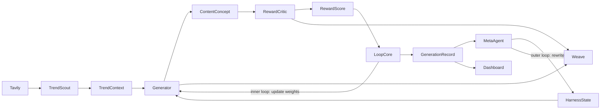

# Architecture

How the pieces connect. Kept deliberately simple. Polyglot: Python backend, TS
dashboard (DECISIONS.md D7).

## Components

**Frontend** (`src/ui/` — Vite + React + Tailwind + Motion; Eng 4)

- Control-room dashboard
- Score curve (hero), element-weight shift
- Generation table + detail drawer
- Living-memory (lessons) panel
- Reads canonical `GenerationRecord[]` through one seam, `src/ui/lib/data.ts`

**Backend** (`harness/` — Python)

- Harness loop (`run_loop`) — inner-loop weights + outer-loop rewrite
- Trend scout (Tavily), content generator, reward critic
- Meta-agent (harness rewriter)
- Weave tracing

**Storage**

- HarnessState + GenerationRecord rows as JSON files (the loop writes; the dashboard reads)
- Generated stubs in `data/stubs/`
- Optional rendered assets (Seedance). Redis is a stretch.

**Tools**: Tavily (trends) · Seedance (video) · W&B Weave (tracing) · Anthropic (generation + critic).

## Loop diagram

The node flow matches the loop in `docs/HARNESS_LOOP.md` and the roles in
`docs/AGENT_ROLES.md`. The data shapes on each edge are defined in
`docs/DATA_CONTRACTS.md` (canonical `harness/contracts.py`).
