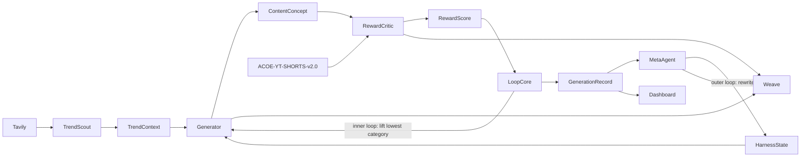

# Architecture

How the pieces connect. Kept deliberately simple. Polyglot: Python backend, TS
dashboard (DECISIONS.md D7). Vertical: AI YouTube Shorts dance videos scored by
ACOE-YT-SHORTS-v2.0.

## Components

**Frontend** (`src/ui/` — Vite + React + Tailwind + Motion; Eng 4)

- Control-room dashboard
- Score curve (hero, climbing toward the viral threshold), element-weight shift
- Generation table + detail drawer (ACOE `category_breakdown`, tier, auto-fails)
- Living-memory (lessons) panel
- Reads canonical `GenerationRecord[]` through one seam, `src/ui/lib/data.ts`
- Migrating to render ACOE (0–100 + tiers) — see `docs/DASHBOARD_MIGRATION.md`

**Backend** (`harness/` — Python)

- Harness loop (`run_loop`) — inner-loop weights + outer-loop rewrite
- Trend scout (Tavily + approved audio pool), dance-Short generator
- Reward critic — applies `data/policies/ACOE-YT-SHORTS-v2.0.json`
- Meta-agent (harness rewriter)
- Weave tracing

**Storage**

- HarnessState + GenerationRecord rows as JSON files (the loop writes; the dashboard reads)
- The evaluation policy in `data/policies/`; generated stubs in `data/stubs/`
- Optional rendered videos (Seedance). Redis is a stretch.

**Tools**: Tavily (trends + audio) · Seedance (dance video) · W&B Weave (tracing) · Anthropic (generation + critic).

## Loop diagram

The node flow matches the loop in `docs/HARNESS_LOOP.md` and the roles in
`docs/AGENT_ROLES.md`. The data shapes on each edge are defined in
`docs/DATA_CONTRACTS.md` (canonical `harness/contracts.py`); the scoring policy
is `docs/JUDGE_RUBRIC.md`.
