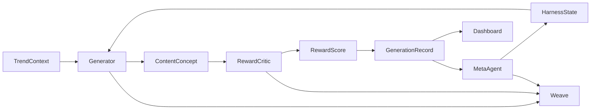

# Architecture

How the pieces connect. Kept deliberately simple.

## Components

**Frontend**

- Dashboard
- City visualization
- Generation table
- Element-weight chart
- Wiki / memory panel

**Backend**

- Harness loop (`runLoop`)
- Content generator
- Reward critic
- Meta-agent (harness rewriter)
- Weave tracing

**Storage**

- HarnessState
- GenerationRecord rows
- Stub trend data (`data/stubs/`)
- Optional generated assets

## Loop diagram

The node flow here matches the 8 steps in `docs/HARNESS_LOOP.md` and the roles
in `docs/AGENT_ROLES.md`. The data shapes on each edge are defined in
`docs/DATA_CONTRACTS.md`.
